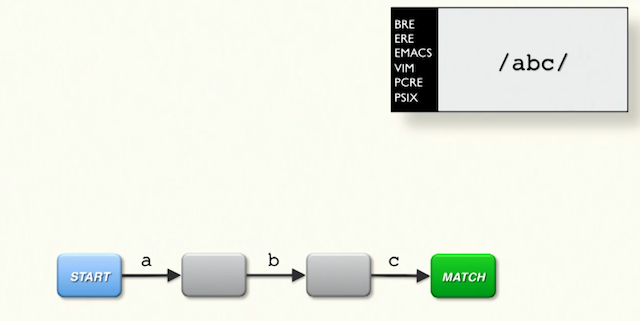
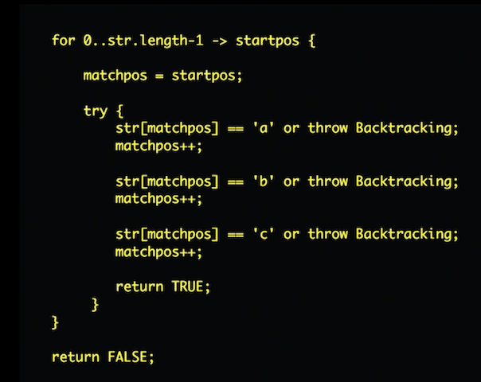

## Regular expressions

* re
* regexes
* regexps
* patterns

---

## What are they

* mini-language (code)
* each char in regex is an instruction

---

## Transition graph



---

## Pseudocode



---

## Target implementation

* Traditional NFA (non-deterministic finite automaton)
* Used also by Java's [Pattern](https://docs.oracle.com/javase/10/docs/api/java/util/regex/Pattern.html#jcc)

---

## Tools

* [Regexp::Debugger](https://metacpan.org/pod/Regexp::Debugger)
* [regex101.com](https://regex101.com)

---

## Precedence

* `|` (alternation) has the lowest precedence

```plain
/^yes|maybe|no$/
```

---

## Quantifiers match only one preceding thing

`*` `+` `?` `{}`

```plain
blabla
/bla{2,}/
```

---

## Greed

* quantifiers match as long a substring as possible

```plain
He said "hi", she said "hello"
/".*"/
```

---

## Eagerness

* leftmost match wins

```plain
good food
/o*/

longest
/long|longer|longest/
```

---

## Backtracking

* engine tries all possibilities until it matches or fails
* entire regex must match not just part of it

```plain
~~~~'XXXX'~~~~
/'.*'/
```

---

## Non-greedy matching

```plain
He said "hi", she said "hello"
/".*?"/
```

---

## .* is not your friend

```plain
~~~~'XXXX'~~~~
/'[^']'/
```

---

## More

* Damian Conway: [Understanding Regular Expressions](https://learning.oreilly.com/videos/understanding-regular-expressions/9781491996300)
* Jeffrey Friedl: [Mastering Regular Expressions](https://www.safaribooksonline.com/library/view/mastering-regular-expressions/0596528124/)
